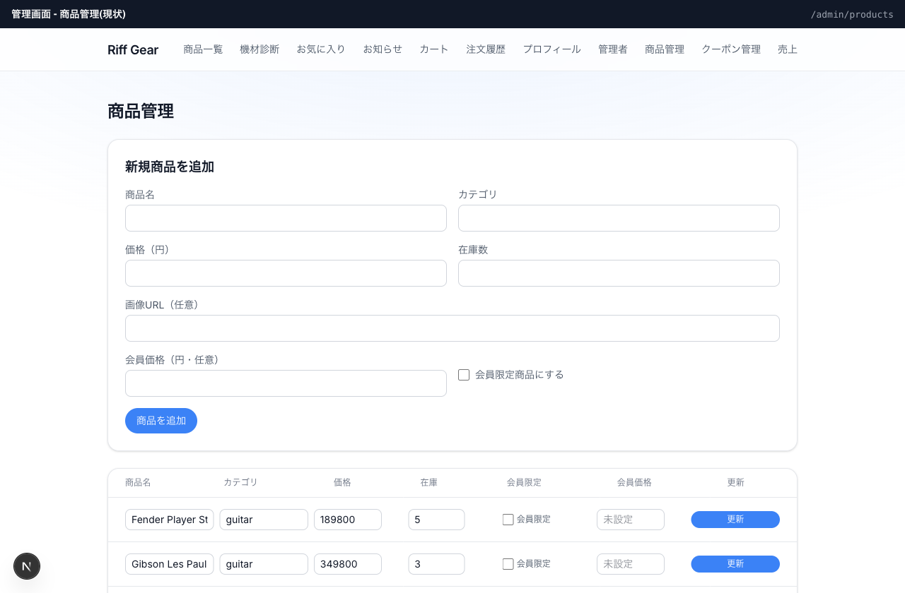
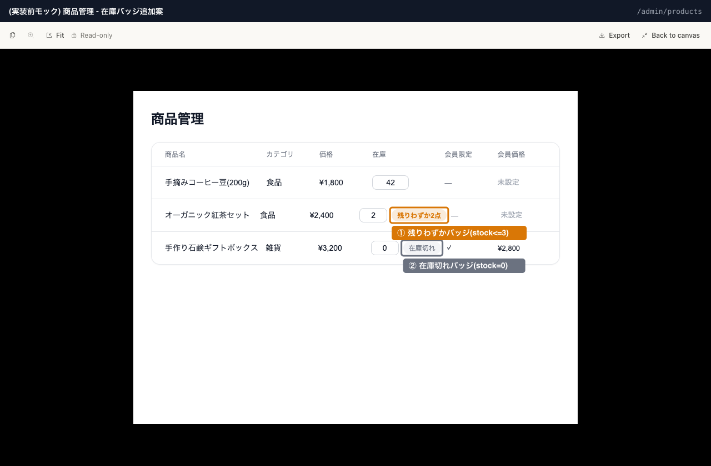

# 商品管理: 在庫切れ・残りわずかバッジ表示

## UI案

### 現状

### 変更後(実装前モック)

### コード調査で分かったこと

- `app/admin/products/page.tsx` は `products` テーブルから `stock` を含む列を既にSELECT済み。新規のデータ取得は不要（UI層のみの変更）
- 在庫の書き込みは `updateProduct` Server Action(`app/admin/products/actions.ts`)経由。`revalidatePath('/admin/products')` と `revalidatePath('/')` で管理画面とストアフロント両方を再検証している
- 認可はUI層の`app_metadata.role === 'admin'`チェック(表示制御)とRLS `products_write_admin_only`(DB側の実効制御、`is_admin()`ゲート)の二層。バッジ表示自体は読み取りのみなので新たな認可判断は不要
- ストアフロント側(`app/ProductCard.tsx:114-133`)に既に同種のバッジパターンがある: `remaining<=0`で灰色「売り切れ」ピル、`remaining<=3`で警告色「残りわずかN点」ピル。今回はこの見た目・閾値をそのまま管理画面のテーブル行に踏襲する

## UI受入条件

- 在庫列の数値inputの右隣にバッジを表示する
- `stock === 0` のとき、灰色ピル「在庫切れ」を表示する(`bg-gray-100 text-gray-500`、ストアフロントの「売り切れ」と同スタイル)
- `stock > 0 && stock <= 3` のとき、警告色ピル「残りわずかN点」を表示する(`bg-warning/15 text-warning`)
- `stock > 3` のときはバッジを表示しない(現状のまま数値inputのみ)
- 新規商品追加フォームにはバッジを表示しない(一覧テーブルの行のみ対象)

## 状態設計

| 状態 | 見せるもの |
|---|---|
| 通常(在庫十分) | 在庫数inputのみ、バッジなし |
| 通常(残りわずか) | 在庫数input + 「残りわずかN点」警告色ピル |
| 通常(在庫切れ) | 在庫数input + 「在庫切れ」灰色ピル |
| 処理中 | 対象外(既存の「更新」ボタンの挙動を変えない。バッジは`stock`の表示専用で送信フローに関与しない) |
| 成功 | `updateProduct`成功後、`revalidatePath`で一覧が再取得され、更新後の`stock`値に応じてバッジが自動的に切り替わる |
| エラー | 対象外(バッジ表示に起因するエラーは無い。在庫更新自体のエラーハンドリングは既存のまま) |
| 権限なし | 対象外(ページ全体の権限なし表示は`page.tsx`に既存。バッジ機能追加による変更なし) |
| 空(商品0件) | 対象外(テーブル自体が空になるだけ。既存の挙動のまま) |

## 業務・認可

- バッジは`products.stock`の読み取り表示のみで、書き込み・認可判断を追加しない
- 既存のRLS(`products_write_admin_only`)・UI層の管理者チェックに変更なし

## 選ぶテスト

- UI: `stock`が0/1〜3/4以上のそれぞれでバッジの表示・非表示・文言が正しいことを確認するコンポーネント/スナップショット相当のテスト

## 影響層

- UI(`app/admin/products/page.tsx`)のみ。データ取得・DBに変更なし
