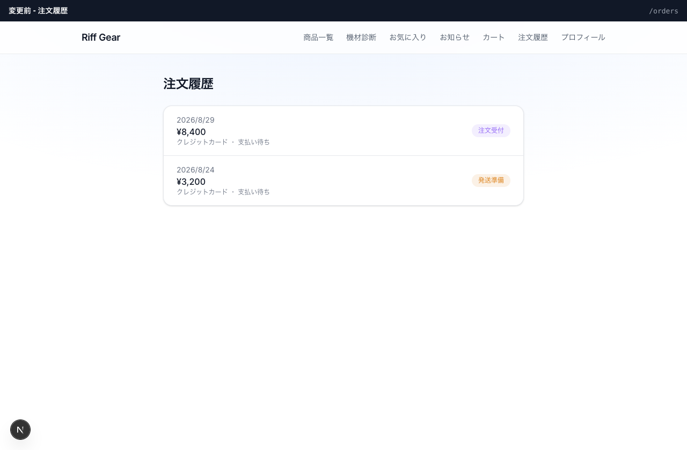
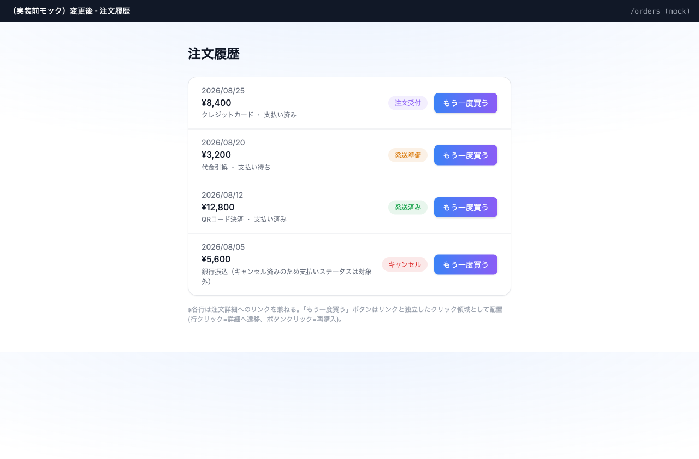

# 機能仕様書 — 注文履歴一覧への「もう一度買う」ボタン追加

## UI案

### 現状

### 変更後

### コード調査で分かったこと

- 「もう一度買う」機能自体は既に`app/orders/[id]/page.tsx`（注文詳細ページ）に実装済み。`reorderOrder`（`app/orders/actions.ts`）を呼ぶ`<form>`が存在する
- `reorderOrder`は`orderId`だけを受け取り、注文明細を取得して`add_cart_item` RPCでカートに再投入する。在庫不足時は買える分だけ追加し、`/cart?error=...`へリダイレクトする。成功時は`/cart`へリダイレクトする
- `reorderOrder`は全ステータス（`received`/`preparing`/`shipped`/`cancelled`）で無条件に呼び出し可能（詳細ページ側で条件分岐していない）
- 今回のタスクは、この既存の`reorderOrder`を注文履歴一覧（`app/orders/page.tsx`）の各行からも呼べるようにするだけで、ロジック自体の新規実装は不要

## UI受入条件

- 一覧の各行の右側、既存のステータスバッジと並べて「もう一度買う」ボタンを配置する
- ボタンの見た目は詳細ページと同じグラデーションスタイル（`bg-gradient-to-r from-primary to-secondary`、白文字、角丸）を踏襲する
- 全ステータス（受付・準備中・発送済み・キャンセル済み）の行にボタンを表示する
- 各行は現在`<Link>`で丸ごとクリッカブルになっており、その中に`<button>`をネストすると不正なHTML（インタラクティブ要素の入れ子）になる。実装時は行全体のリンクをやめ、左側の情報部分（日付・金額・支払い情報）だけを`<Link>`にし、ボタンをその外側（行の兄弟要素）に配置する

## 状態設計

| 状態 | 見せるもの |
|---|---|
| 通常 | 各行に日付・金額・支払い情報・ステータスバッジ・「もう一度買う」ボタン |
| 処理中 | 特別な処理中表示なし（既存の`reorderOrder`はサーバーアクションのフォーム送信であり、詳細ページも処理中表示は無い。既存挙動を踏襲） |
| 成功 | `/cart`へリダイレクトされ、カートページでカート内容を確認できる（既存の`reorderOrder`の挙動をそのまま踏襲） |
| エラー | 在庫不足等で一部商品のみ追加できなかった場合、`/cart?error=...`のエラーメッセージが表示される（既存挙動を踏襲） |
| 権限なし | 対象外（注文履歴はログインユーザー本人のみアクセス可能。既存のログインガードをそのまま利用） |
| 空 | 注文が1件も無い場合、ボタンを含む行自体が表示されない（既存の`orders?.map`の挙動をそのまま踏襲、空状態向けの追加UIは今回スコープ外） |

## 業務・認可

- RLSにより`orders`テーブルは本人の行しか返らないため、他ユーザーの注文に対して再購入ボタンを操作することはできない
- `reorderOrder`自体の認可（本人の注文のみ明細取得可能）は既存のRLSに委ねる。今回新たな認可ロジックは追加しない

## 選ぶテスト

- UI: 手動E2Eで、各ステータスの行から再購入ボタンを押してカートに反映されることを確認する
- RLS: 対象外（既存の`reorderOrder`・RLSポリシーを変更しないため）
- RPC統合: 対象外（`add_cart_item` RPC自体は無変更）
- E2E: 一覧 → 再購入ボタン → カートへの反映、を手動で確認する
