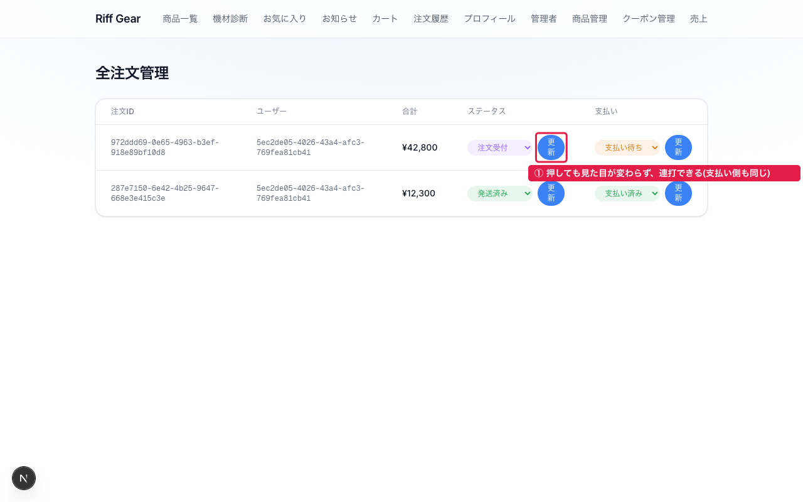
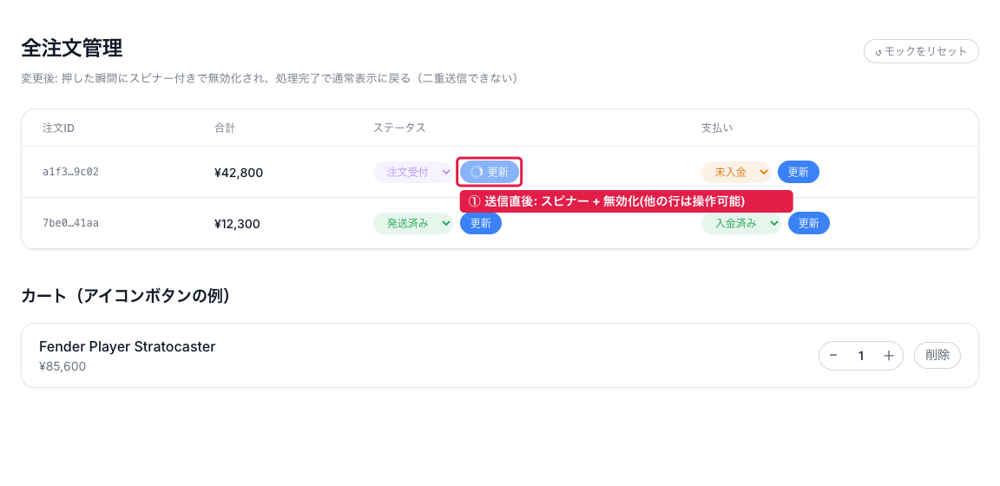
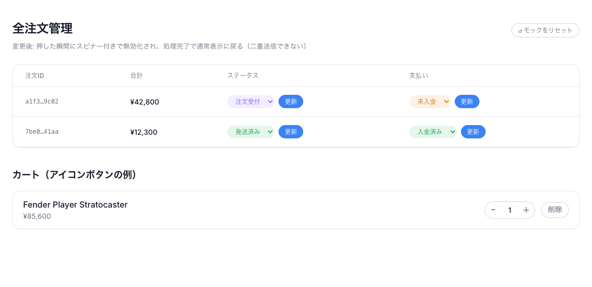
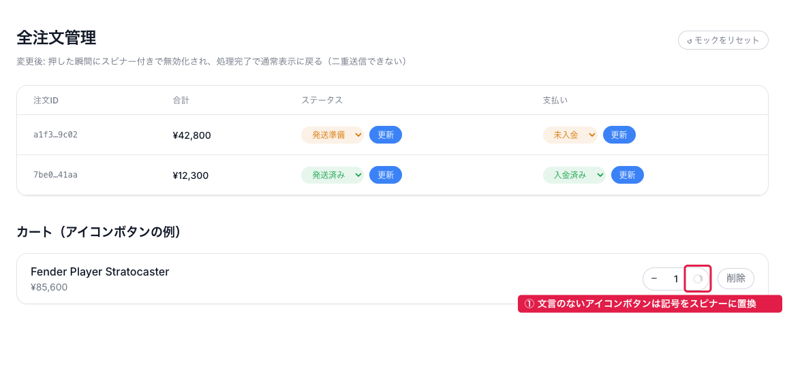
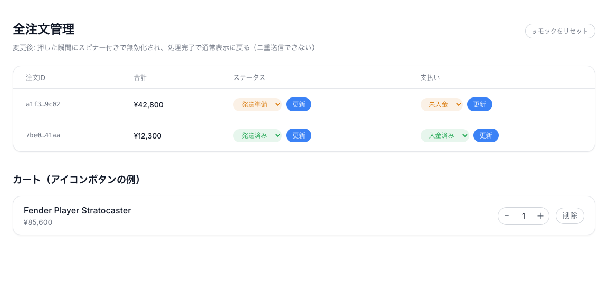
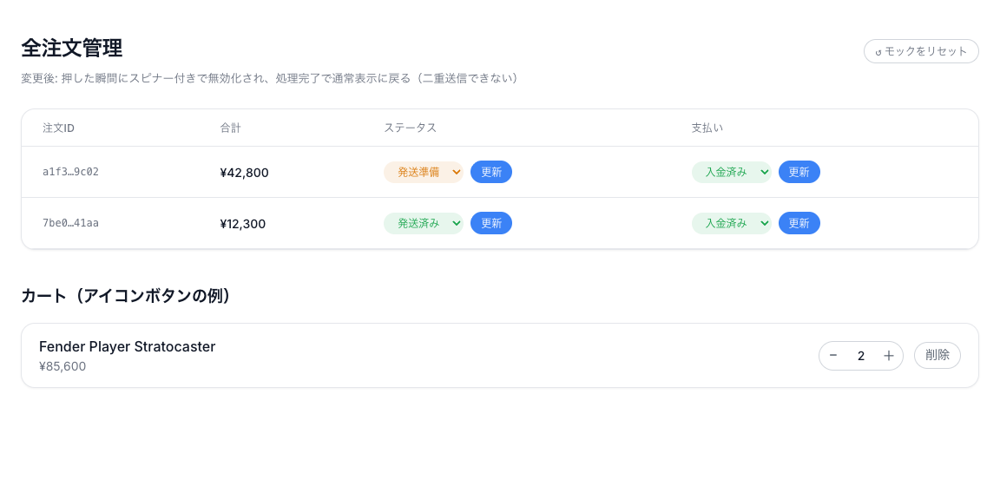

# 機能仕様書 — Server Actionフォームの送信ボタンに処理中表示(スピナー+無効化)を付ける

インタラクティブモック(クリックで動く): https://claude.ai/code/artifact/7430cb9b-90db-4c55-bc61-1aa71b79ed28
モックのソース: [mock/](./mock/)（`Before.dc.html`=現状、`Main.dc.html`=変更後）

## UI案

### 現状 (app/admin/orders/page.tsx)

### 変更後 (app/admin/orders/page.tsx ほか16ボタン、実装前モック)

### コード調査で分かったこと

- フォーム送信ボタンのうち処理中表示があるのは4つだけ（`FavoriteButton`・`RestockButton`は`useOptimistic`でトグル、`CheckoutForm`は`useState`で「処理中...」、`ProductCard`はスピナー+「追加中...」）。残り**16個(10ファイル)**は押しても何も変わらず、サーバー処理が終わって`revalidatePath`/`redirect`で画面が差し替わるまで無反応（提案時に「13個」と伝えたのは数え漏れ。`grep -c 'type="submit"'`で数え直した結果が16）
- 16個の呼び出し先Server Actionはすべて「DB更新→`revalidatePath`または`redirect`」の形で、成功時に値を返さない。失敗時は`throw`して`app/global-error.tsx`に落ちる（本タスクでは変更しない）
- 対象ページのほとんどはServer Component（`page.tsx`に`'use client'`が無い）。`useFormStatus`はクライアントコンポーネントでしか使えないが、**`<form>`の中の`<button>`だけをクライアントコンポーネントに切り出せば、ページ自体はServer Componentのまま**処理中状態を取れる（`useFormStatus`は最も近い親`<form>`の送信状態を返す）
- 一部のボタンは既に`disabled`条件を持つ（カートの「＋」は`quantity >= stock`、`ReviewForm`の送信は`rating === 0`）。処理中の無効化はこれらと**OR**で合成する必要がある
- 実ページでは「更新」ボタンがテーブル列幅の都合で2行に折り返している（before画像参照）。スピナーを足すと更に崩れるため、共通ボタンは`whitespace-nowrap`を持つ

### 対象ボタン一覧（16個・10ファイル）

| # | ファイル | ボタン | Server Action | 種別 |
|---|---|---|---|---|
| 1 | app/admin/orders/page.tsx | ステータス「更新」 | updateOrderStatus | 文言あり・行ごと |
| 2 | app/admin/orders/page.tsx | 支払い「更新」 | updatePaymentStatus | 文言あり・行ごと |
| 3 | app/admin/coupons/page.tsx | 「クーポンを作成」 | createCoupon | 文言あり |
| 4 | app/admin/coupons/page.tsx | 「無効化」 | deactivateCoupon | 文言あり・行ごと |
| 5 | app/admin/products/page.tsx | 「商品を追加」 | createProduct | 文言あり |
| 6 | app/admin/products/page.tsx | 「更新」 | updateProduct | 文言あり・行ごと |
| 7 | app/cart/page.tsx | 「−」 | updateCartItemQuantity | アイコンのみ |
| 8 | app/cart/page.tsx | 「＋」 | updateCartItemQuantity | アイコンのみ・既存disabled条件あり |
| 9 | app/cart/page.tsx | 「削除」 | removeFromCart | 文言あり |
| 10 | app/orders/page.tsx | 「もう一度買う」 | reorderOrder | 文言あり・行ごと |
| 11 | app/products/[id]/page.tsx | 「カートに追加」 | addToCart | 文言あり |
| 12 | app/reviews/ReviewForm.tsx | 「投稿する」/「更新する」 | submitReview | 文言あり・既存disabled条件あり |
| 13 | app/reviews/ReviewList.tsx | 「参考になった」投票 | toggleHelpfulVote | 文言あり・行ごと |
| 14 | app/reviews/ReviewList.tsx | 「削除」 | deleteReview | 文言あり・行ごと |
| 15 | app/profile/page.tsx | 「保存」 | updateProfile | 文言あり |
| 16 | app/notifications/page.tsx | 「すべて既読にする」 | markRestockNotificationsRead | 文言あり |

## UI受入条件

- 共通コンポーネント`app/components/SubmitButton.tsx`（`'use client'`、`useFormStatus`）を新設し、上記のボタンを置き換える。**各ページのServer Componentとしての構造・`<form action>`・hidden inputは変えない**（ボタン要素の差し替えのみ）
- 見た目は**スピナー+無効化**。文言は変えない（「更新」は処理中も「更新」のまま。スピナーを左に添える）。スピナーは`ProductCard`の既存SVG（`animate-spin`、`h-4 w-4`）を流用し、ボタンの文字サイズに合わせて`text-xs`のボタンでは`h-3.5 w-3.5`にする
- 文言のないアイコンボタン（「−」「＋」）は、記号をスピナーに置き換える（幅32pxのボタン内に両方は入らないため）
- 処理中は`disabled`かつ`aria-busy="true"`。既存の`disabled`条件がある場合はORで合成する（`disabled={pending || 外部条件}`）
- ボタンの`className`は呼び出し側から渡してそのまま使う（各ページの既存スタイルを維持する。共通コンポーネントが見た目を強制しない）。共通側は`inline-flex items-center justify-center gap-1.5 whitespace-nowrap`と`disabled:cursor-wait`だけを足す
- 同じ画面に複数フォームがあっても、押したボタンだけが処理中になる（`useFormStatus`は`<form>`単位。モックの「他の行は操作可能」を実装でも満たす）
- 既に処理中表示を持つ4箇所（`FavoriteButton`・`RestockButton`・`CheckoutForm`・`ProductCard`）は**変更しない**（トグル型・遷移型でUXが異なるため）

## 状態設計

| 状態 | 見せるもの | 画像(モックで再現した状態のみ) |
|---|---|---|
| 通常 | 現状と同じ見た目・同じ文言のボタン |  |
| 処理中 | 押したボタンだけスピナー付き・無効化・`aria-busy`。同じ画面の他のフォームは操作可能 |  / アイコンボタン:  |
| 成功 | Server Actionの`revalidatePath`/`redirect`で画面が差し替わり、ボタンは通常に戻る（既存挙動） |  |
| エラー | 既存どおり`throw`→`global-error.tsx`。本タスクでは変えない（`useFormStatus`はエラーでも`pending`が`false`に戻るのでボタンは復帰する） | (モック対象外) |
| 権限なし | 各ページの既存ガード（管理者チェック・ログイン必須）をそのまま利用。ボタン側に変更なし | (対象外) |
| 空 | 一覧が0件ならボタンを含む行が出ない（既存挙動） | (対象外) |
| 二重送信 | 処理中に同じボタンを2回押しても1回分しか送信されない（`disabled`のため） |  |

## 業務・認可

- 認可・RLS・Server Actionのロジックは一切変更しない。処理中表示はクライアント側の見た目だけであり、二重送信防止も「UX上の防御」に過ぎない（サーバー側の冪等性は既存の`place_order`冪等キー等に委ねる。今回対象の16ボタンのアクションは元々二重実行しても業務上の実害が小さいもの—ステータス更新の再送は同値上書き、数量±1は2回実行されると2進む点だけは注意）

## 変更する箇所／変更しない箇所

- 変更する: `app/components/SubmitButton.tsx`（新規）、上記16箇所の`<button type="submit">`を`<SubmitButton>`に置換
- 変更しない: すべてのServer Action（`actions.ts`）、`lib/`、DB、既に処理中表示を持つ4コンポーネント、各ページのレイアウト・文言

## 選ぶテスト

- UI: `[UI]`は基盤未整備（`aidd-phase2.js`の`TEST_TYPES`で`established: false`）。今回は**手動E2E**で代替する。基盤整備（`@testing-library/react`+`jsdom`の導入）は別issueとする
- E2E: 手動。devサーバーで(1)管理者注文一覧の「更新」を押してスピナー→復帰、(2)カートの「＋」でスピナー置換、(3)処理中の連打で1回しか進まない、を確認する。Server Actionを人為的に遅延させて処理中状態を目視できるようにする（一時的な`await new Promise(r => setTimeout(r, 1500))`を入れて確認後に削除）
- RLS: 対象外（変更なし）
- RPC統合: 対象外（変更なし）
- unit: 対象外（`SubmitButton`は`useFormStatus`の値を表示に写すだけで純粋ロジックが無い）
